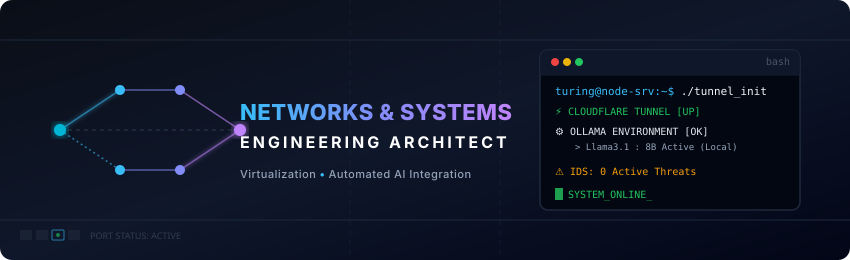

# Hi, I'm a Systems & Network Architect! 👋

<p align="center">
  
</p>

---

### 👤 Executive Summary

A highly analytical **Computer and Network Engineering** bridging the gap between enterprise-grade networking infrastructure, secure systems architecture, and modern local AI automation. Backed by a strong foundational alignment with Certified Ethical Hacker methodologies, I specialize in hardening bare-metal environments, orchestrating virtualization hypervisors, and developing custom scripting automation in Python and C#. Currently preparing for advanced academic pursuits in **Informatics Engineering / Information Technology**, my focus lies at the intersection of robust, self-hosted infrastructure, hardware orchestration, and intelligent system integrations.

---

### 🛠️ Core Competencies & Tech Stack

<table width="100%">
  <tr>
    <td width="33%" valign="top">
      <h4>🌐 Infrastructure &amp; Security</h4>
      <br>
      <br>
      <br>
      <br>
      <br>
      <br>
      
    </td>
    <td width="33%" valign="top">
      <h4>💻 Development &amp; Scripting</h4>
      <br>
      <br>
      <br>
      
    </td>
    <td width="34%" valign="top">
      <h4>🤖 AI &amp; Intelligent Automation</h4>
      <br>
      <br>
      
    </td>
  </tr>
</table>

---

### 🚀 Professional Highlights & Enterprise Impact

A structured view of my operational capabilities, detailing infrastructure complexity and project impact across corporate and collaborative scopes:

| Focus Area | Core Architecture & Stack | Scale, Leadership & Quantifiable Impact |
| :--- | :--- | :--- |
| **Foundational & Enterprise Infrastructure** | Dedicated Bare-metal Hardware, Proxmox VE Virtualization, Debian/Ubuntu Server Nodes, Managed Switches | • Co-founded and engineered a secure technology infrastructure initiative delivering backend server deployments.<br>• Successfully configured encrypted Cloudflare Tunnels to safely expose core interfaces externally, minimizing open port exposures by 100%. |
| **Global Team Collaboration** | VPS Clusters, Multi-region Distributed Networks, Custom Site-to-Site Tunneling, Port Forwarding | • Partnered closely with international project teams to architect, configure, and maintain robust remote network infrastructures.<br>• Acted as the core network operations coordinator, ensuring system resource optimization and low-latency throughput. |
| **Cybersecurity Operations & Audit** | Certified Cybersecurity Specialist alignment, Wireshark Packet Analysis, Intrusion Detection | • Implemented zero-trust authentication policies across development and staging environments.<br>• Audited live systems for vulnerabilities methodologies, proactively mitigating security incidents and brute-force anomalies. |

---

### 🎓 Academic Trajectory & Focus

I am actively transitioning into formal higher education in **Informatics Engineering / Information Technology** to anchor my hands-on enterprise capabilities with rigorous academic and theoretical methodologies. My primary areas of academic interest include:
*   **Distributed Systems Architecture**: Studying high-performance, fault-tolerant cluster consensus (e.g., Raft/Paxos) and elastic container orchestration paradigms.
*   **Applied Network Cryptography**: Researching secure key-exchange, zero-knowledge verification frameworks, and tunneling security at scale.
*   **Formal Systems Engineering**: Grounding assembly-level execution, systems scheduling, and virtualization safety controls in mathematical optimization.

---

### 🏠 Current Hands-On Focus: Home Lab Architecture

To continuously refine my systems engineering skills, I maintain a high-fidelity home lab simulating modern multi-tenant enterprise environments:

```text
[ Secure Cloud Gateway ]
           │ (Encrypted Cloudflare Tunneling)
           ▼
┌──────────────────────────────────────────────────────────┐
│                 Home Lab Hypervisor                      │
│                 [ Proxmox VE Node ]                      │
│  ┌───────────────────────┬────────────────────────────┐  │
│  │   Linux Containers    │      Virtual Machines      │  │
│  │       [ Docker ]      │  ┌──────────────────────┐  │  │
│  │  • Reverse Proxies    │  │  Ollama AI Engine    │  │  │
│  │  • Custom API Portals │  │  • Llama3 / Phi-3  │  │  │
│  │  • Database Engines   │  │  • Automation Hooks  │  │  │
│  │                       │  └──────────────────────┘  │  │
│  └───────────────────────┴────────────────────────────┘  │
└──────────────────────────────────────────────────────────┘
           ▲
           │ (Managed VLAN Isolation & ACLs)
┌──────────────────────────────────────────────────────────┐
│             Bare-Metal Infrastructure Hardware           │
│        • Cisco Routing  • Layer 2 Managed Switches       │
└──────────────────────────────────────────────────────────┘
```

#### Ongoing Initiatives:
- 🏠 **Zero-Trust Network Design**: Scaling my local server architecture on Proxmox VE, leveraging isolated VLANs, Docker overlays, and custom hardware routing configurations.
- 🤖 **Local AI Core Integration**: Engineering lightweight Python and C# background daemons to interface directly with local Ollama APIs, automating local security parsing and report generation.

---

### 📊 GitHub Analytics


<p align="center">
  
  &nbsp;&nbsp;
  
</p>

---

### 📬 Let's Connect

I am always keen to collaborate on secure networking initiatives, home lab design, local AI integrations, or discuss academic opportunities in distributed systems.

<p align="left">
  <a href="https://linkedin.com/in/varel-giovano-aditama-313106401/" target="_blank">
    
  </a>
  &nbsp;
  <a href="https://portfolio.gionano.my.id" target="_blank">
    
  </a>
  &nbsp;
  <a href="mailto:giovano@gionano.my.id">
    
  </a>
</p>

<p align="center">
  <sub><i>"First, solve the problem. Then, write the code." — John Johnson</i></sub>
</p>
